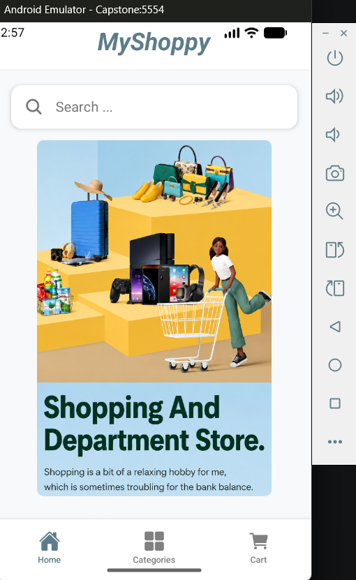
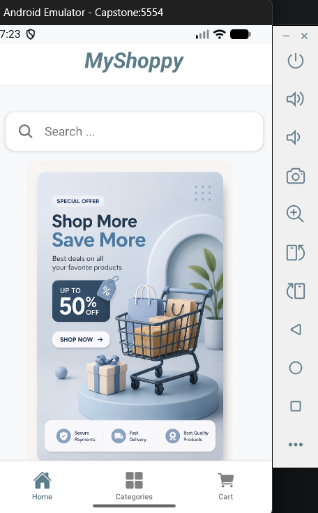

# MyShoppy - Household Shopping Mobile Application

MyShoppy is a React Native mobile shopping application that provides a simple and user-friendly shopping experience. Users can browse products by category, search and sort products, view detailed product information, manage their shopping cart, and place orders through a basic checkout process.

---

## Features

- Browse household products across multiple categories
- Search products by name
- Category-wise product browsing
- Sort products by:
  - Price: Low to High
  - Price: High to Low
- Product Details screen
  - Product image
  - Description
  - Price
  - Rating
  - Availability Status
- Wishlist
- Shopping Cart
  - Add products
  - Update quantities
  - Remove products with confirmation
- Checkout
  - Customer details form
  - Input validation
  - Order summary
- Order Confirmation
- Cart data management using AsyncStorage
- Product data fetched from JSON Server

---

## Tech Stack

### Frontend
- React Native
- Expo
- TypeScript
- React Navigation

### Backend
- JSON Server (Mock REST API)

### Local Storage
- AsyncStorage

---

## Application Screenshots

### Home & Category Screens

| Home Screen | Home Screen Carousel |
|--------------|-----------------|
|  |  |

---

### Product Browsing

| Product Listing | Product Details |
|-----------------|-----------------|
|  |  |

---

### Search & Sorting

| Search | Sort |
|---------|------|
|  |  |

---

### Shopping Cart

| Cart Screen | Checkout |
|-------------|----------|
|  |  |

---

### Validation & Order Confirmation

| Validation | Order Confirmation |
|------------|--------------------|
|  |  |

--- 

## Project Structure

```
MyShoppy_FizaYasmeen
│
├── assets/                  # Images, icons and other static assets
│
├── screenshots/             # Application screenshots for documentation
│
├── src/
│   │
│   ├── components/
│   │   ├── Cards/           # Product, Category and Cart card components
│   │   ├── Header/          # Header and Search Bar components
│   │   └── Home/            # Home screen UI components
│   │
│   ├── config/              # API configuration and application settings
│   │
│   ├── constants/           # Colors, fonts, spacing and global styles
│   │
│   ├── navigation/          # Stack and Bottom Tab navigation
│   │
│   ├── screens/             # Application screens
│   │
│   └── utils/               # Utility functions and image mapping
│
├── App.tsx                  # Root component
├── app.json                 # Expo configuration
├── data.json                # JSON Server mock database
├── index.ts                 # Application entry point
├── package.json             # Project dependencies
├── package-lock.json        # Dependency lock file
├── tsconfig.json            # TypeScript configuration
├── README.md                # Project documentation
```

---

## Getting Started

### Prerequisites

- Node.js
- npm
- Expo CLI
- Android Studio Emulator or Expo Go

### Installation

Clone the repository

```bash
git clone <repository-url>
```

Install dependencies

```bash
npm install
```

Start the JSON Server

```bash
npx json-server --watch db.json --port 3000
```

Update the API Base URL with your local IP address if running on a physical device.

Start the Expo development server

```bash
npx expo start
```

Run the application using:

- Android Emulator
- Expo Go

## Screens

- Home Screen
- Category Screen
- Product Listing Screen
- Product Details Screen
- Shopping Cart
- Customer Details Screen
- Order Confirmation Screen

---
> **Note:** If running the app on a physical device using Expo Go App, update the `API_BASE_URL` in the project to your computer's local IP address so the device can connect to the JSON Server.

## Developed By

**Fiza Yasmeen**

Mobile Application Development Project
